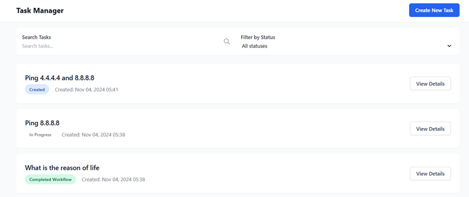

# BOSS - LLM Operating System

BOSS is an intelligent task orchestration system that leverages Large Language Models (LLMs) to coordinate and execute agent-based workflows. Think of it as a smart task manager that can:

- **Break Down Complex Tasks:** Decompose intricate tasks into manageable, actionable steps.
- **Smart Agent Selection:** Assign the most suitable agent for each step based on capabilities.
- **Real-time Monitoring & Adaptation:** Track execution progress, handle failures, and optimize workflows on the fly.
- **Robust Error Handling:** Implement multiple retry strategies with intelligent failure analysis.
- **Human-in-the-Loop:** Recognize when to escalate tasks for human intervention.
- **Performance Monitoring:** Continuously monitor system health and agent performance.

> **Note:** This project is still under development and not all features are fully implemented. **Do not use in production.**
> *This project currently focuses on network security related reasoning tasks. At the same time,BOSS can be extended to other domains with ease.*

## Table of Contents

- [Key Features](#key-features)
- [Architecture](#architecture)
- [Quick Start](#quick-start)
  - [Local Setup](#local-setup)
  - [Launching BOSS](#launching-boss)
  - [Integrating Agents](#integrating-agents)
- [How It Works](#how-it-works)
- [Configuration](#configuration)
- [Agent Integration](#agent-integration)
- [Task States](#task-states)
- [License](#license)

## Key Features

- **Intelligent Task Analysis:** Automatically assesses task complexity and required steps.
- **Smart Agent Selection:** Matches tasks with the most capable agents.
- **Real-time Adaptation:** Adjusts workflows based on performance and results.
- **Robust Error Handling:** Implements multiple retry strategies with intelligent failure analysis.
- **Human-in-the-Loop:** Recognizes when to request human intervention.
- **Performance Monitoring:** Tracks system health and agent performance.
- **Agent Wrappers:** Provides an abstract interface (`WrapperAgent`) for integrating various agents seamlessly.
- **Prompt Management:** Utilizes structured prompts (`BossPrompts`) to interact with LLMs for task planning and evaluation.

## Architecture

```plaintext
+----------------------------------------------------------------------------------------------------------+
|                                            BOSS OPERATING SYSTEM                                         |
|                                    (Brain Operating System & Scheduler)                                  |
+----------------------------------------------------------------------------------------------------------+

                                          [Task Scheduler]
                                          (10s interval)
                                               |
                                               v
                  +-----------------------> Task Processor <--------------------+
                  |                             |                              |
                  |                             v                              |
                  |                    +----------------+                      |
                  |                    | LLM Planning   |                      |
                  |                    | - Step Gen     |                      |
                  |                    | - Evaluation   |                      |
                  |                    | - Agent Select |                      |
                  |                    +----------------+                      |
                  |                             |                              |
        +-----------------+                     v                    +-----------------+
        |    MongoDB     | <------------> Message Bus (Kafka) <---> | System Monitor  |
        | - Tasks        |                     |                    | - Health Checks |
        | - Agent Status |                     v                    +-----------------+
        +-----------------+           +------------------+
                                     |   Agent Network   |
                                     |   +-----------+   |
                                     |   | Network   |   |
                                     |   |  - Ping   |   |
                                     |   |  - WHOIS  |   |
                                     |   |  - SSL    |   |
                                     |   +-----------+   |
                                     |   |   API     |   |
                                     |   | - REST    |   |
                                     |   | - WebSock |   |
                                     |   +-----------+   |
                                     +------------------+
                                             ^
                                             |
                                     +------------------+
                                     | Result Consumer  |
                                     +------------------+

Data Flow:
----------
1. Scheduler checks for tasks every 10s
2. Task Processor uses LLM to:
   - Generate steps
   - Evaluate results
   - Select appropriate agents
3. Tasks dispatched via Kafka
4. Agents execute tasks
5. Results collected by Consumer
6. MongoDB stores state
7. Monitor ensures system health

Process Loop:
------------
Check Tasks (10s) -> Process -> Plan (LLM) -> Execute (Agents) -> Collect Results -> Update State -> Repeat
```

## Quick Start

### Local Setup

1. **Clone the Repository**


2. **Create Virtual Environment & Install Dependencies:**
   ```bash
   python -m venv venv
   source venv/bin/activate  # On Windows: venv\Scripts\activate
   pip install -r requirements.txt
   ```

3. **Build Web Components:**
   ```bash
   cd web && docker compose build
   ```

4. **Start Infrastructure Services:**
   ```bash
   # In root directory
   docker compose up
   ```
   This command starts:
   - **Web UI**
   - **Kafka Message Broker**
   - **MongoDB Database**

### Launching BOSS

1. **Initialize the Orchestration System:**
   ```bash
   python ./start.py
   ```
   This script initializes BOSS and its agents, setting up necessary connections and listeners.


Result in UI:

**Ping:**   


**Ping and Port Scan:**


### Environment Variables

- **OPENAI_API_KEY:** API key for accessing OpenAI's services.
- **MONGODB_URI:** Connection string for the MongoDB database.
- **KAFKA_BOOTSTRAP_SERVERS:** Address of the Kafka broker.
- **ANTHROPIC_API_KEY:** API key for accessing Anthropic's services.

## Agent Integration

To integrate new agents into BOSS, follow these steps:

1. **Subclass `WrapperAgent`:**
   - Create a new Python file for your agent.
   - Subclass the `WrapperAgent` abstract class.
   - Implement the `process_task` method with your agent's specific logic.

2. **Implement `process_task`:**
   - This method receives a task dictionary.
   - Process the task as per your agent's capabilities.
   - Return a result dictionary containing task outcomes.

3. **Start the Agent:**
   - Instantiate your agent class with a unique `agent_id`.
   - Call the `start` method to begin listening for tasks.


## Task States

BOSS manages tasks through various states to ensure efficient orchestration and tracking. Below are the possible states a task can be in:

```python
from enum import Enum

class TaskState(str, Enum):
    CREATED = "Created"
    IN_PROGRESS = "In_Progress"
    WAITING_FOR_EVALUATION = "Waiting_For_Evaluation"
    AWAITING_HUMAN = "Awaiting_Human"
    COMPLETED_STEP = "Completed_Step"
    COMPLETED_WORKFLOW = "Completed_Workflow"
    FAILED = "Failed"
    PENDING_NEXT_STEP = "Pending_Next_Step"
    PAUSED = "Paused"
    FINAL_COMPLETION = "Final_Complition"
```

## License

This project is licensed under the Apache 2.0 License - see the [LICENSE](LICENSE) file for details.
