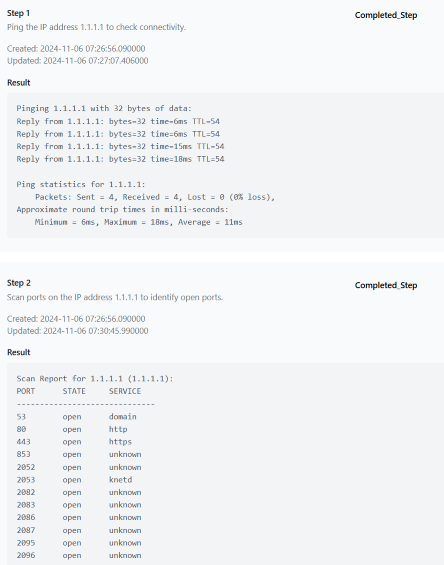

# BOSS - Multi-Agent LLM Operating System For Offensive Security

BOSS is an intelligent task orchestration system that leverages Large Language Models (LLMs) to coordinate and execute agent-based workflows. Think of it as a smart task manager that can:

- **Break Down Complex Tasks:** Decompose intricate tasks into manageable, actionable steps.
- **Smart Agent Selection:** Assign the most suitable agent for each step based on capabilities.
- **Real-time Monitoring & Adaptation:** Track execution progress, handle failures, and optimize workflows on the fly.
- **Robust Error Handling:** Implement multiple retry strategies with intelligent failure analysis.
- **Human-in-the-Loop:** Recognize when to escalate tasks for human intervention.
- **Performance Monitoring:** Continuously monitor system health and agent performance.

> **Note:** This project is still under development and not all features are fully implemented. **Do not use in production.**


#### **This project currently focuses on network security related reasoning tasks. At the same time,BOSS can be extended to other domains with ease.**


## Architecture
```
+-----------------------+
|  BOSS OPERATING SYS   |
+-----------------------+
          |
          v
+-----------------------+
|    Task Scheduler     |
|      (10s interval)   |
+-----------------------+
          |
          v
+-----------------------+
|    Task Processor     |
|   - LLM Planning      |
|     - Step Generation |
|     - Evaluation      |
|     - Agent Selection |
+-----------------------+
          |
          v
+-----------------------+
|   Message Bus (Kafka) |
+-----------------------+
          |
          v
+-----------------------+
|     Agent Network     |
| - Ping                |
| - WHOIS               |
| - SSL                 |
| - REST Test           |
| - WebSocket Test      |
| - Scan Ports          |
| - Get SSL Cert        |
| - API Explorer        |
| - Conversation        |
| - DIG Agent           |
+-----------------------+
          |
          v
+-----------------------+
|    Result Consumer    |
+-----------------------+
          |
          v
+-----------------------+
|        MongoDB        |
| - Tasks               |
| - Agent Status        |
+-----------------------+
          |
          v
+-----------------------+
|    System Monitor     |
| - Health Checks       |
+-----------------------+

Data Flow:
1. Scheduler checks for tasks every 10s
2. Processor uses LLM to:
   - Generate steps
   - Evaluate results
   - Select appropriate agents
3. Dispatch tasks via Kafka
4. Agents execute tasks
5. Collect results via Consumer
6. Store/update state in MongoDB
7. Monitor ensures system health
8. Loop back to step 1
```

## Quick Start

## Local Setup

1. **Clone the Repository**


2. **Create Virtual Environment & Install Dependencies:**
   ```bash
   python -m venv venv
   source venv/bin/activate  # On Windows: venv\Scripts\activate
   pip install -r requirements.txt
   ```

3. **Build Web Components:**
   ```bash
   cd web && docker compose build
   ```

4. **Start Infrastructure Services:**
   ```bash
   # In root directory
   docker compose up
   ```
   This command starts:
   - **Web UI**
   - **Kafka Message Broker**
   - **MongoDB Database**

### Launching BOSS

1. **Initialize the Orchestration System:**
   ```bash
   python ./start.py
   ```
   This script initializes BOSS and its agents, setting up necessary connections and listeners.


## Example Results in Task Management UI:

**Ping and Port Scan:**




## Environment Variables

- **OPENAI_API_KEY:** API key for accessing OpenAI's services.
- **MONGODB_URI:** Connection string for the MongoDB database.
- **KAFKA_BOOTSTRAP_SERVERS:** Address of the Kafka broker.
- **ANTHROPIC_API_KEY:** API key for accessing Anthropic's services.

## Agent Integration

To integrate new agents into BOSS, follow these steps:

- Subclass WrapperAgent:

   Create a new Python file for your agent (e.g., wrapper_new_agent.py).
   Subclass the WrapperAgent abstract class.
   Implement the process_task method with your agent's specific logic.
   Implement process_task:

   This method receives a task dictionary.
   Process the task as per your agent's capabilities.
   Return a result dictionary containing task outcomes.

```python
from boss.wrappers.wrapper_agent import WrapperAgent

class WrapperNewAgent(WrapperAgent):
    def process_task(self, task: Dict) -> Dict[str, Any]:
        # Your agent's processing logic here
        result = {
            "task_id": task["_id"],
            "result": "Processed successfully",
            "metadata": {},
        }
        return result
```

-  Register and Start the Agent:

   Add your new agent class to the components_to_start list in start.py.
   Ensure your agent has a unique agent_id.
   Launch BOSS to start listening for tasks assigned to your new agent.

```python

components_to_start = [
    BOSS,
    WrapperPing,
    WrapperConversation,
    WrapperScanPortAgent,
    WrapperGetSSLCertificateAgent,
    WhoisWrapperAgent,
    DigWrapperAgent,
    WrapperRESTTestAgent,
    WrapperWebSocketTestAgent,
    WrapperAPIExplorer,
    WrapperNewAgent,  # Add your new agent here
]
```
- Defined Task States:

```python
from enum import Enum

class TaskState(str, Enum):
    CREATED = "Created"
    IN_PROGRESS = "In_Progress"
    WAITING_FOR_EVALUATION = "Waiting_For_Evaluation"
    AWAITING_HUMAN = "Awaiting_Human"
    COMPLETED_STEP = "Completed_Step"
    COMPLETED_WORKFLOW = "Completed_Workflow"
    FAILED = "Failed"
    PENDING_NEXT_STEP = "Pending_Next_Step"
    PAUSED = "Paused"
    FINAL_COMPLETION = "Final_Complition"
```

## License

This project is licensed under the Apache 2.0 License - see the [LICENSE](LICENSE) file for details.
